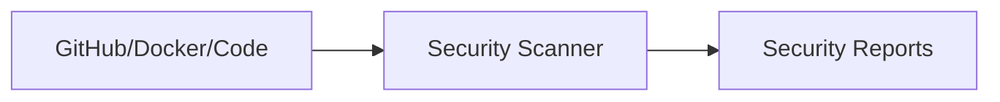

# Minimal Repository Demonstrating SBOM / SCA Scanning

* Scanning is done through a [GitHub action](./.github/workflows/scan.yml).
* You can see the action runs in the [Actions View](TBD).
* You can view Security findings in the [advanced security tab](TBD).

## Architecture

Most devsecops scanners follow a similar structure:

