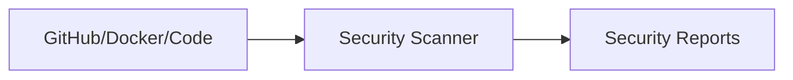

# Minimal Repository Demonstrating SBOM / SCA Scanning

* Scanning is done through a [GitHub action](./.github/workflows/scan.yml).
* You can see the action runs in the [Actions View](https://github.com/ethan42/sbom-sca-scanner/actions).
* You can view Security findings under Security -> Code Scanning (note: you need to have collaborator access to see these findings).

## Configuration

To get your Github Action to run, you need a [Dockerhub account and a PAT token](https://docs.docker.com/security/for-developers/access-tokens/).

You also need to add two [action secrets to your repository](https://docs.github.com/en/actions/security-for-github-actions/security-guides/using-secrets-in-github-actions#creating-secrets-for-a-repository):

* DOCKERHUB_USERNAME
* DOCKERHUB_TOKEN

## Architecture

Most devsecops scanners follow a similar structure:

